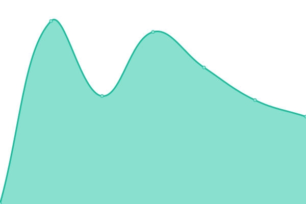

# [📈 Live Status](https://Acenox.github.io/Status): <!--live status--> **🟧 Partial outage**

This repository contains the open-source uptime monitor and status page for [Joris](https://hydeos.fr), powered by [Upptime](https://github.com/upptime/upptime).

With [Upptime](https://upptime.js.org), you can get your own unlimited and free uptime monitor and status page, powered entirely by a GitHub repository. We use [Issues](https://github.com/Acenox/Status/issues) as incident reports, [Actions](https://github.com/Acenox/Status/actions) as uptime monitors, and [Pages](https://Acenox.github.io/Status) for the status page.

<!--start: status pages-->
<!-- This summary is generated by Upptime (https://github.com/upptime/upptime) -->
<!-- Do not edit this manually, your changes will be overwritten -->
<!-- prettier-ignore -->
| URL | Status | History | Response Time | Uptime |
| --- | ------ | ------- | ------------- | ------ |
|  [Arragon](https://arragon.hydeos.fr) | 🟩 Up | [arragon.yml](https://github.com/Acenox/Status/commits/HEAD/history/arragon.yml) | 

 512ms
     
 | 

<a href="https://Acenox.github.io/Status/history/arragon">100.00%</a>
    

|  [NeoliaMC](https://neoliamc.fr) | 🟥 Down | [neolia-mc.yml](https://github.com/Acenox/Status/commits/HEAD/history/neolia-mc.yml) | 

 881ms
     
 | 

<a href="https://Acenox.github.io/Status/history/neolia-mc">93.82%</a>
    

|  [Funcraft - Site web](https://www.funcraft.net/fr) | 🟩 Up | [funcraft-site-web.yml](https://github.com/Acenox/Status/commits/HEAD/history/funcraft-site-web.yml) | 

 831ms
     
 | 

<a href="https://Acenox.github.io/Status/history/funcraft-site-web">100.00%</a>
    

|  [Forum - Funcraft](https://community.funcraft.net/) | 🟩 Up | [forum-funcraft.yml](https://github.com/Acenox/Status/commits/HEAD/history/forum-funcraft.yml) | 

 655ms
     
 | 

<a href="https://Acenox.github.io/Status/history/forum-funcraft">100.00%</a>
    

|  [Forum - Pactify](https://community.ascentia.fr/) | 🟩 Up | [forum-pactify.yml](https://github.com/Acenox/Status/commits/HEAD/history/forum-pactify.yml) | 

 815ms
     
 | 

<a href="https://Acenox.github.io/Status/history/forum-pactify">100.00%</a>
    

<!--end: status pages-->

[**Visit our status website →**](https://Acenox.github.io/Status)

## 📄 License

- Powered by: [Upptime](https://github.com/upptime/upptime)
- Code: [MIT](./LICENSE) © [Joris](https://hydeos.fr)
- Data in the `./history` directory: [Open Database License](https://opendatacommons.org/licenses/odbl/1-0/)
