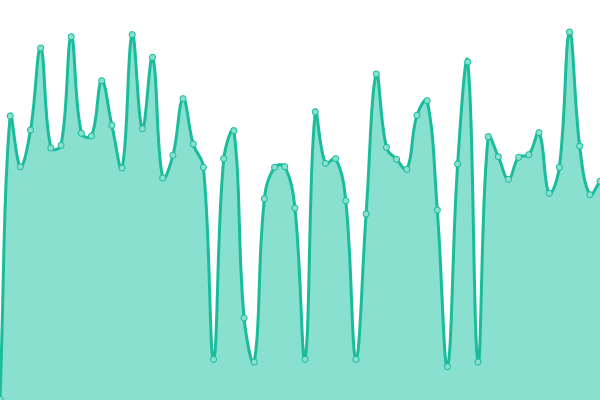

# [📈 Live Status](https://Acenox.github.io/Status): <!--live status--> **🟩 All systems operational**

This repository contains the open-source uptime monitor and status page for [Joris](https://hydeos.fr), powered by [Upptime](https://github.com/upptime/upptime).

With [Upptime](https://upptime.js.org), you can get your own unlimited and free uptime monitor and status page, powered entirely by a GitHub repository. We use [Issues](https://github.com/Acenox/Status/issues) as incident reports, [Actions](https://github.com/Acenox/Status/actions) as uptime monitors, and [Pages](https://Acenox.github.io/Status) for the status page.

<!--start: status pages-->
<!-- This summary is generated by Upptime (https://github.com/upptime/upptime) -->
<!-- Do not edit this manually, your changes will be overwritten -->
<!-- prettier-ignore -->
| URL | Status | History | Response Time | Uptime |
| --- | ------ | ------- | ------------- | ------ |
|  [Hydeos](https://hydeos.fr) | 🟩 Up | [hydeos.yml](https://github.com/JorisPV/Status/commits/HEAD/history/hydeos.yml) | 

 481ms
     
 | 

<a href="https://JorisPV.github.io/Status/history/hydeos">100.00%</a>
    

|  [Panel - Hydeos](https://pterodactyl.hydeos.fr) | 🟩 Up | [panel-hydeos.yml](https://github.com/JorisPV/Status/commits/HEAD/history/panel-hydeos.yml) | 

 626ms
     
 | 

<a href="https://JorisPV.github.io/Status/history/panel-hydeos">100.00%</a>
    

|  [Arragon](https://arragon.hydeos.fr) | 🟩 Up | [arragon.yml](https://github.com/JorisPV/Status/commits/HEAD/history/arragon.yml) | 

 442ms
     
 | 

<a href="https://JorisPV.github.io/Status/history/arragon">100.00%</a>
    

|  [Funcraft - Site web](https://www.funcraft.net/fr) | 🟩 Up | [funcraft-site-web.yml](https://github.com/JorisPV/Status/commits/HEAD/history/funcraft-site-web.yml) | 

 1925ms
     
 | 

<a href="https://JorisPV.github.io/Status/history/funcraft-site-web">98.51%</a>
    

|  [Forum - Funcraft](https://community.funcraft.net/) | 🟩 Up | [forum-funcraft.yml](https://github.com/JorisPV/Status/commits/HEAD/history/forum-funcraft.yml) | 

 667ms
     
 | 

<a href="https://JorisPV.github.io/Status/history/forum-funcraft">99.67%</a>
    

|  [Pactify](https://www.pactify.fr/) | 🟩 Up | [pactify.yml](https://github.com/JorisPV/Status/commits/HEAD/history/pactify.yml) | 

 2058ms
     
 | 

<a href="https://JorisPV.github.io/Status/history/pactify">99.05%</a>
    

|  [AZ-Launcher](https://az-launcher.nz/) | 🟩 Up | [az-launcher.yml](https://github.com/JorisPV/Status/commits/HEAD/history/az-launcher.yml) | 

 1090ms
     
 | 

<a href="https://JorisPV.github.io/Status/history/az-launcher">100.00%</a>
    

|  [Forum - Ascentia](https://community.ascentia.fr/) | 🟩 Up | [forum-ascentia.yml](https://github.com/JorisPV/Status/commits/HEAD/history/forum-ascentia.yml) | 

 2214ms
     
 | 

<a href="https://JorisPV.github.io/Status/history/forum-ascentia">89.20%</a>
    

|  [Account - Ascentia](https://account.ascentia.fr/) | 🟩 Up | [account-ascentia.yml](https://github.com/JorisPV/Status/commits/HEAD/history/account-ascentia.yml) | 

 2097ms
     
 | 

<a href="https://JorisPV.github.io/Status/history/account-ascentia">99.06%</a>
    

|  [Boutique - Ascentia](https://store.ascentia.fr/) | 🟩 Up | [boutique-ascentia.yml](https://github.com/JorisPV/Status/commits/HEAD/history/boutique-ascentia.yml) | 

 2061ms
     
 | 

<a href="https://JorisPV.github.io/Status/history/boutique-ascentia">99.07%</a>
    

|  [Joris - Perso](https://joris-parmentier.fr) | 🟩 Up | [joris-perso.yml](https://github.com/JorisPV/Status/commits/HEAD/history/joris-perso.yml) | 

 650ms
     
 | 

<a href="https://JorisPV.github.io/Status/history/joris-perso">99.78%</a>
    

|  [Joris - Acenox](https://acenox.fr) | 🟩 Up | [joris-acenox.yml](https://github.com/JorisPV/Status/commits/HEAD/history/joris-acenox.yml) | 

 799ms
     
 | 

<a href="https://JorisPV.github.io/Status/history/joris-acenox">100.00%</a>
    

<!--end: status pages-->

[**Visit our status website →**](https://Acenox.github.io/Status)

## 📄 License

- Powered by: [Upptime](https://github.com/upptime/upptime)
- Code: [MIT](./LICENSE) © [Joris](https://hydeos.fr)
- Data in the `./history` directory: [Open Database License](https://opendatacommons.org/licenses/odbl/1-0/)
