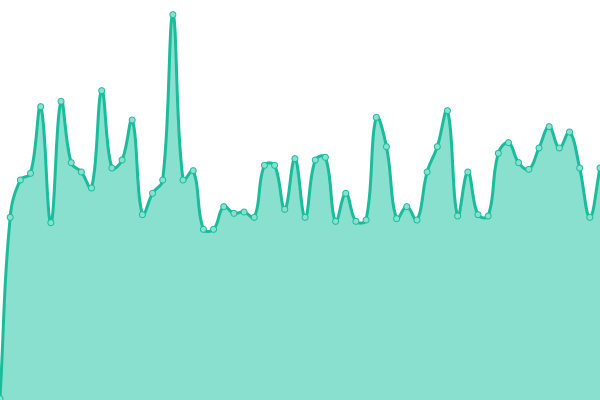
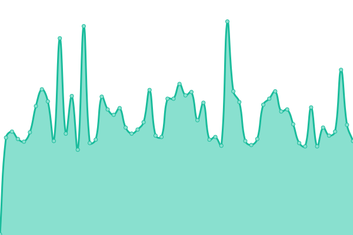
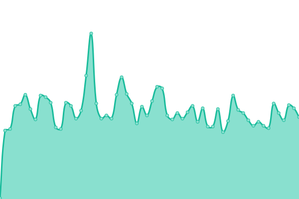

# [📈 Status](https://JorisPV.github.io/Status): <!--live status--> **Un service est dégradé**

<!--start: status pages-->
<!-- This summary is generated by Upptime (https://github.com/upptime/upptime) -->
<!-- Do not edit this manually, your changes will be overwritten -->
<!-- prettier-ignore -->
| URL | Status | Historique | Temps de réponse | Uptime |
| --- | ------ | ------- | ------------- | ------ |
|  [Hydeos](https://hydeos.fr) | 🟩 Up | [hydeos.yml](https://github.com/JorisPV/Status/commits/HEAD/history/hydeos.yml) | 

 135ms
     
 | 

<a href="https://JorisPV.github.io/Status/history/hydeos">100.00%</a>
    

|  [Mysql - Hydeos](https://phpmyadmin.hydeos.fr) | 🟩 Up | [mysql-hydeos.yml](https://github.com/JorisPV/Status/commits/HEAD/history/mysql-hydeos.yml) | 

 158ms
     
 | 

<a href="https://JorisPV.github.io/Status/history/mysql-hydeos">100.00%</a>
    

|  [Arragon](https://arragon.hydeos.fr) | 🟩 Up | [arragon.yml](https://github.com/JorisPV/Status/commits/HEAD/history/arragon.yml) | 

 135ms
     
 | 

<a href="https://JorisPV.github.io/Status/history/arragon">100.00%</a>
    

|  [Grafana](https://grafana.hydeos.fr) | 🟩 Up | [grafana.yml](https://github.com/JorisPV/Status/commits/HEAD/history/grafana.yml) | 

 174ms
     
 | 

<a href="https://JorisPV.github.io/Status/history/grafana">100.00%</a>
    

|  [Pactify](https://www.pactify.fr/) | 🟩 Up | [pactify.yml](https://github.com/JorisPV/Status/commits/HEAD/history/pactify.yml) | 

 137ms
     
 | 

<a href="https://JorisPV.github.io/Status/history/pactify">100.00%</a>
    

|  [AZ-Launcher](https://az-launcher.nz/) | 🟩 Up | [az-launcher.yml](https://github.com/JorisPV/Status/commits/HEAD/history/az-launcher.yml) | 

 329ms
     
 | 

<a href="https://JorisPV.github.io/Status/history/az-launcher">100.00%</a>
    

|  [Forum - Ascentia](https://community.ascentia.fr/) | 🟩 Up | [forum-ascentia.yml](https://github.com/JorisPV/Status/commits/HEAD/history/forum-ascentia.yml) | 

 174ms
     
 | 

<a href="https://JorisPV.github.io/Status/history/forum-ascentia">100.00%</a>
    

|  [Account - Ascentia](https://account.ascentia.fr/) | 🟥 Down | [account-ascentia.yml](https://github.com/JorisPV/Status/commits/HEAD/history/account-ascentia.yml) | 

 97ms
     
 | 

<a href="https://JorisPV.github.io/Status/history/account-ascentia">0.00%</a>
    

|  [Boutique - Ascentia](https://store.ascentia.fr/) | 🟩 Up | [boutique-ascentia.yml](https://github.com/JorisPV/Status/commits/HEAD/history/boutique-ascentia.yml) | 

 145ms
     
 | 

<a href="https://JorisPV.github.io/Status/history/boutique-ascentia">100.00%</a>
    

|  [Joris - Perso](https://joris-parmentier.fr) | 🟥 Down | [joris-perso.yml](https://github.com/JorisPV/Status/commits/HEAD/history/joris-perso.yml) | 

 110ms
     
 | 

<a href="https://JorisPV.github.io/Status/history/joris-perso">44.80%</a>
    

|  [Joris - Acenox](https://acenox.fr) | 🟩 Up | [joris-acenox.yml](https://github.com/JorisPV/Status/commits/HEAD/history/joris-acenox.yml) | 

 132ms
     
 | 

<a href="https://JorisPV.github.io/Status/history/joris-acenox">100.00%</a>
    

<!--end: status pages-->

[**Clique-ici pour voir la page de Status →**](https://jorispv.github.io/Status)

## 📄 License

- Powered by: [Upptime](https://github.com/upptime/upptime)
- Code: [MIT](./LICENSE) © [Joris](https://hydeos.fr)
- Data in the `./history` directory: [Open Database License](https://opendatacommons.org/licenses/odbl/1-0/)
